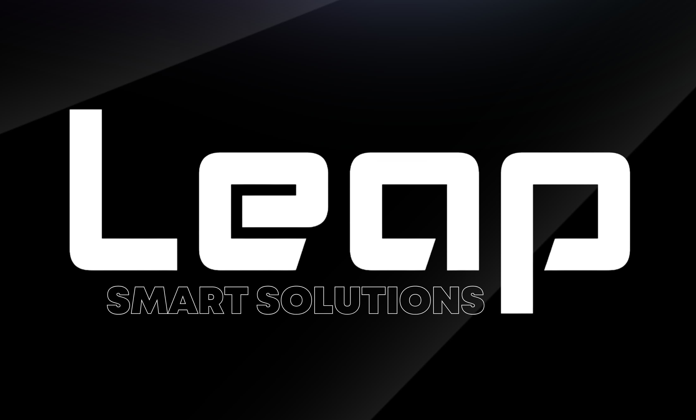

# LEAP: Smart Solutions

<p align="center">
   
</p>

<p align="center">
   <strong>Empowering Intelligent Home Automation with Advanced AI, IoT, and Seamless User Experience</strong>
</p>

<p align="center">
   <a href="https://github.com/1AyaNabil1/Leap-Smart-Control-System/blob/main/LICENSE">
      
   </a>
   <a href="https://github.com/1AyaNabil1/Leap-Smart-Control-System/graphs/contributors">
      
   </a>
   <a href="https://github.com/1AyaNabil1/Leap-Smart-Control-System">
      
   </a>
   <a href="https://github.com/1AyaNabil1/Leap-Smart-Control-System">
      
   </a>
   <a href="https://github.com/1AyaNabil1/Leap-Smart-Control-System">
      
   </a>
   <a href="https://github.com/1AyaNabil1/Leap-Smart-Control-System/blob/main/CODE_OF_CONDUCT.md">
      
   </a>

## Executive Summary

The **LEAP Smart Control System** is a premium, multi-disciplinary platform designed to revolutionize home automation. By integrating state-of-the-art artificial intelligence, computer vision, IoT hardware, and intuitive user interfaces, LEAP delivers a secure, scalable, and user-centric solution for modern smart homes and facilities. This project is engineered for reliability, extensibility, and real-world impact, making it suitable for both research and commercial deployment.

---

---


## Repository Structure & Modules

```plaintext
Leap-Smart-Control-System/
├── Chatbot/
├── Documentation/
├── Face_Recognition/
├── Gesture_Recognition/
├── Imgs/
├── Mobile_Application/
├── IoT_Development/
├── Web_Development/
└── README.md
```

### Module Overview

- **Chatbot**: Advanced conversational AI for natural language interaction and system control.
- **Face Recognition**: Secure biometric authentication using deep learning-based face detection and embedding.
- **Gesture Recognition**: Real-time gesture-based device control leveraging computer vision and ML.
- **Mobile Application**: Cross-platform app for remote access, notifications, and device management.
- **Ring Development**: Hardware integration for wearable smart ring, enabling gesture and proximity-based control.
- **Web Development**: Responsive web dashboard for centralized monitoring, analytics, and administration.
- **IoT Development**: Firmware and hardware modules for smart device connectivity and automation.
- **Documentation**: Comprehensive technical and user documentation for all modules.

---


## Key Features

- **AI-Driven Chatbot**: Real-time, context-aware assistance and automation via natural language.
- **Face Recognition**: Deep learning-based biometric authentication for secure access control.
- **Gesture Control**: Touchless device management using computer vision and ML-powered gesture recognition.
- **Mobile App**: Intuitive Android/iOS application for remote monitoring, notifications, and control.
- **Smart Ring**: Innovative wearable hardware for seamless, gesture-based system interaction.
- **Web Dashboard**: Enterprise-grade web interface for analytics, device management, and user administration.
- **IoT Integration**: Robust support for smart devices, sensors, and actuators with real-time data flow.
- **Scalable Architecture**: Modular design supporting easy extension, integration, and deployment.

---


## Project Objectives

- Advance home and facility security through multi-factor, biometric authentication.
- Deliver a frictionless, intuitive user experience across all interfaces and devices.
- Integrate cutting-edge hardware and software for next-generation automation.
- Enable remote, real-time control and monitoring of all connected systems.
- Foster innovation and research in smart environments and human-computer interaction.

---


## System Requirements

### Hardware
- Modern smartphone (Android/iOS)
- IoT-enabled devices (lights, locks, cameras, sensors)
- Smart ring (optional, for advanced control)
- Standard PC/server for backend processing

### Software
- Python 3.8+
- TensorFlow, Keras, OpenCV (AI/ML modules)
- Android Studio or React Native (mobile app)
- Web stack: HTML, CSS, JavaScript, Flask/Streamlit (dashboard)
- Additional libraries: Firebase, SQLite, MQTT, etc.

---


## Installation & Setup

1. **Clone the Repository**
   ```bash
   git clone https://github.com/Leap-Smart-Solutions/Leap-Smart-Control-System.git
   cd Leap-Smart-Control-System
   ```

2. **Install Dependencies**
   ```bash
   pip install -r requirements.txt
   ```

3. **Module Configuration**
   - Refer to the `Documentation` directory for step-by-step setup of Face Recognition, Gesture Recognition, IoT, and other modules.
   - Configure hardware devices and network settings as described in the documentation.

4. **Run the System**
   ```bash
   python main.py
   ```

5. **Mobile & Web Setup**
   - Build and deploy the mobile app using Android Studio or React Native.
   - Launch the web dashboard via Flask/Streamlit as per instructions in `web/`.

---


## Usage Guide

- **Chatbot**: Launch the chatbot module for intelligent, conversational control of devices and system queries.
- **Face Recognition**: Authenticate users via the camera interface for secure access and personalized automation.
- **Gesture Recognition**: Use supported gestures to control devices without physical contact.
- **Mobile Application**: Install and connect the app for remote management, notifications, and real-time updates.
- **Web Dashboard**: Access the dashboard for analytics, device status, and administrative functions.
- **Smart Ring**: Utilize the wearable for advanced, gesture-based control and proximity authentication.

---


## Contributing

We welcome contributions from the community and industry professionals. To contribute:

1. Fork this repository.
2. Create a feature branch (`git checkout -b feature/your-feature`).
3. Commit your changes with clear, descriptive messages.
4. Push your branch to your fork.
5. Submit a Pull Request with a detailed description of your changes and rationale.

Please review our coding standards and contribution guidelines in the `Documentation` folder before submitting.

---


## License

This project is released under the MIT License. See the [LICENSE](LICENSE) file for full details.

---


## Acknowledgements

This project is made possible by the dedication of our development team, contributors, and academic mentors. We thank all collaborators for their expertise and support throughout the development lifecycle.

---

## Contact & Support

For technical support, partnership inquiries, or further information, please contact the project maintainers via [GitHub Issues](https://github.com/1AyaNabil1/Leap-Smart-Control-System/issues) or refer to the documentation for direct contact details.
